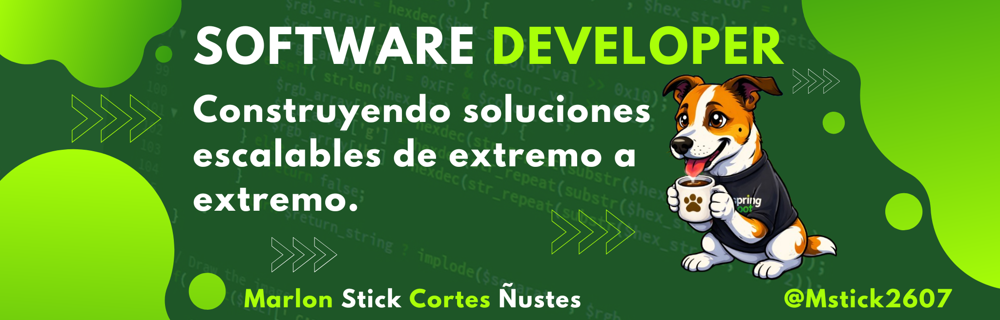

#   Bienvenid@ al GitHub de Marlon Stick

Desarrollador de Software con ADN backend y visión integral de producto. Mi especialidad es construir arquitecturas robustas y escalables con Java, Spring Boot y Microservicios, pero mi alcance no termina en el servidor: domino el ecosistema frontend con Angular, React y Vue.js para crear experiencias de usuario fluidas y reactivas.

Experto en conectar lógica compleja con interfaces intuitivas, utilizando Kafka para mensajería en tiempo real y Docker para entornos consistentes. Me apasiona el Clean Code y la construcción de soluciones integrales, desde el diseño de la base de datos hasta el último componente de la interfaz de usuario.

## Tecnologías

<!--
**Mastick2607/Mastick2607** is a ✨ _special_ ✨ repository because its `README.md` (this file) appears on your GitHub profile.

Here are some ideas to get you started:

- 🔭 I’m currently working on ...
- 🌱 I’m currently learning ...
- 👯 I’m looking to collaborate on ...
- 🤔 I’m looking for help with ...
- 💬 Ask me about ...
- 📫 How to reach me: ...
- 😄 Pronouns: ...
- ⚡ Fun fact: ...
-->
